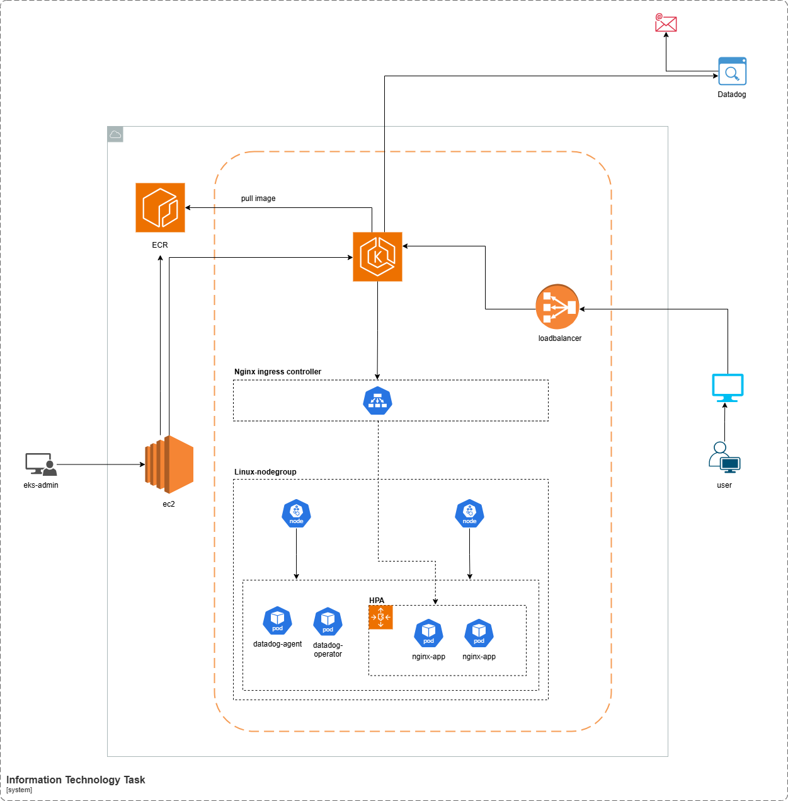
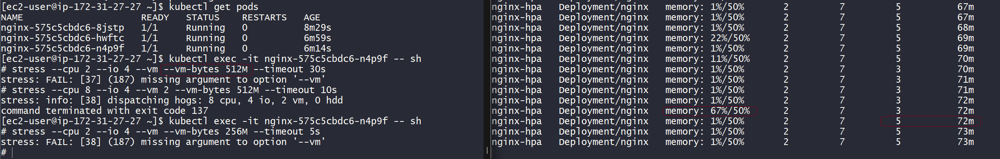
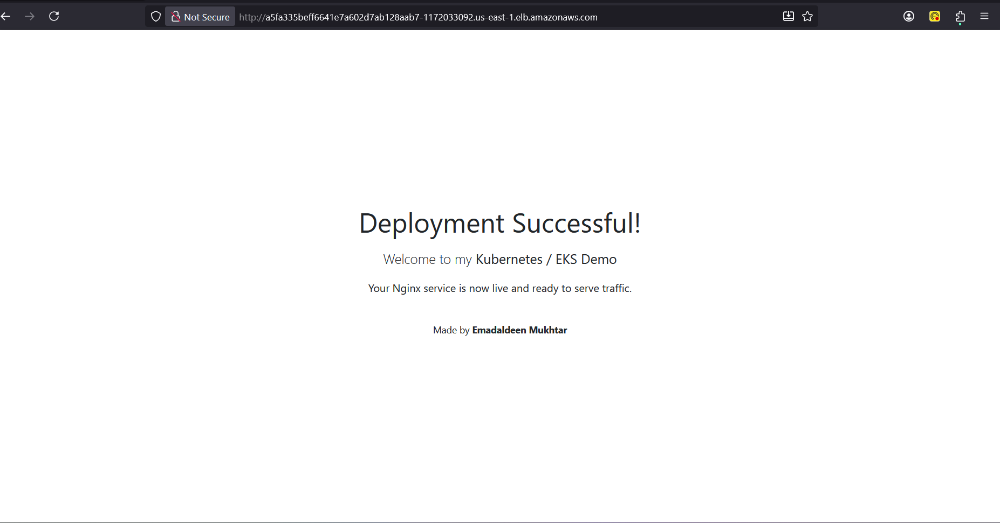
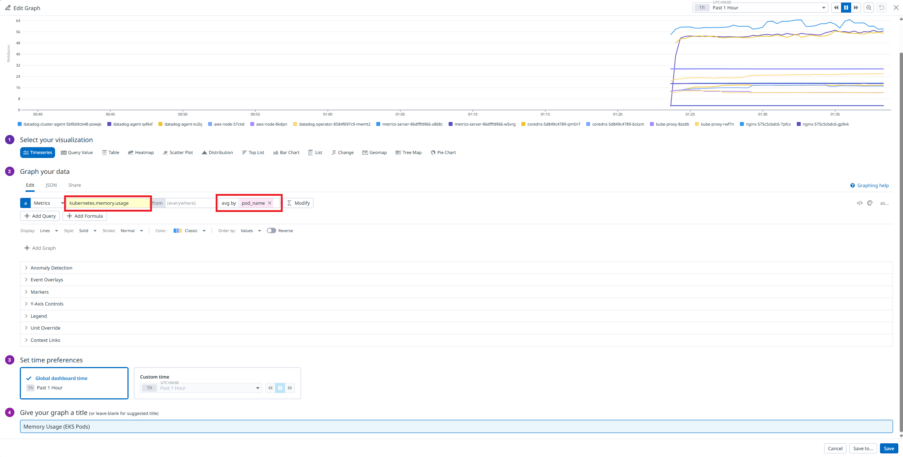
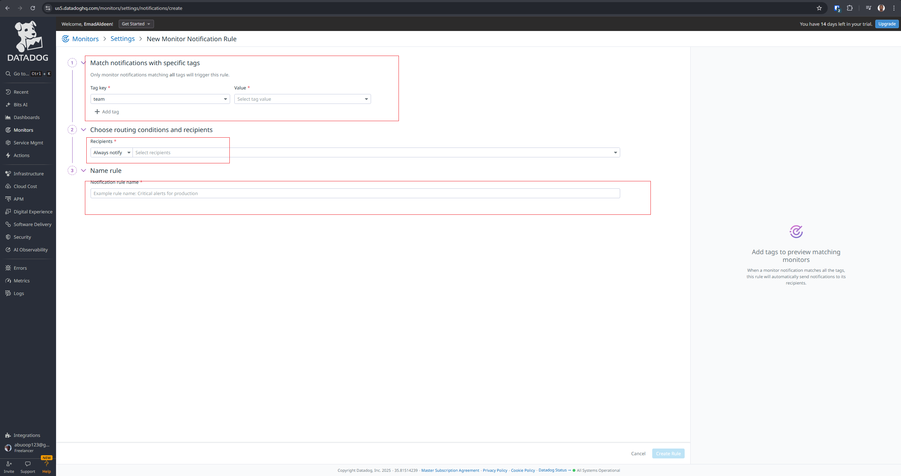
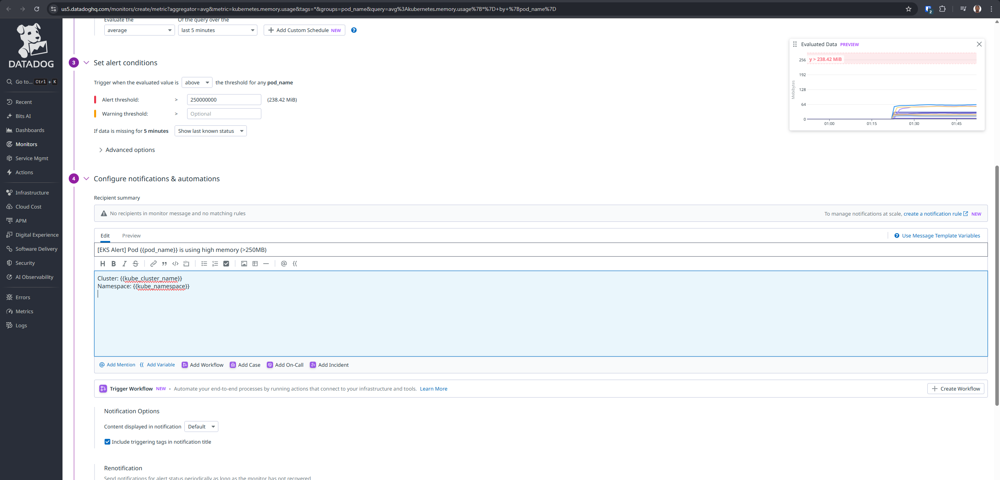
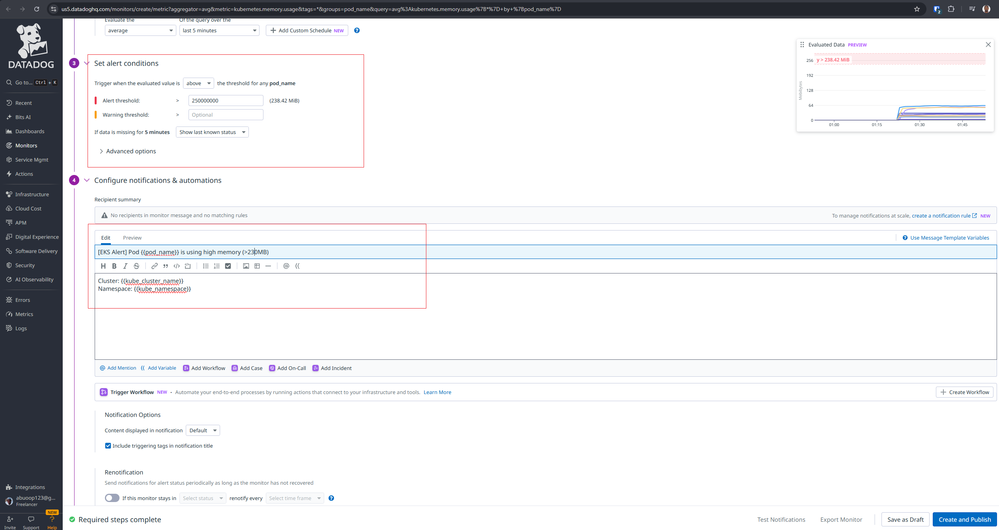
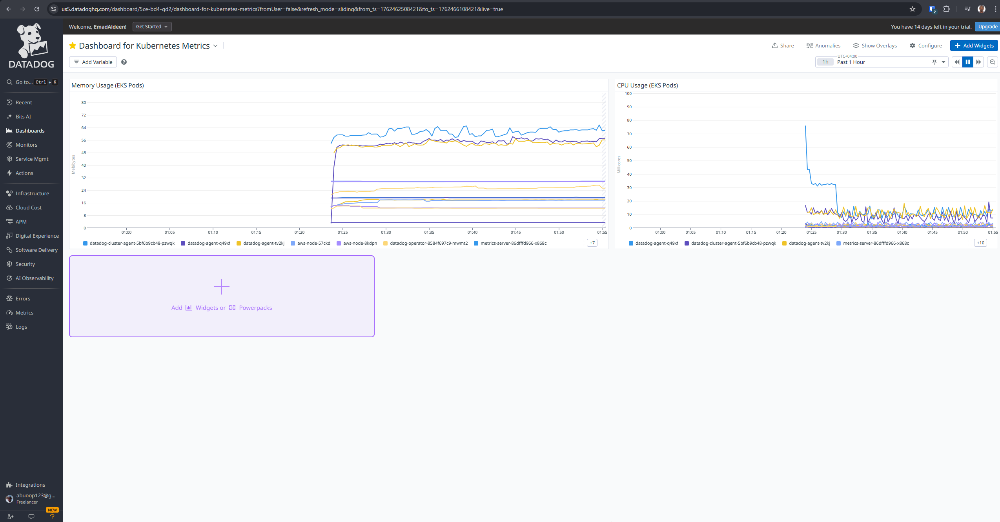
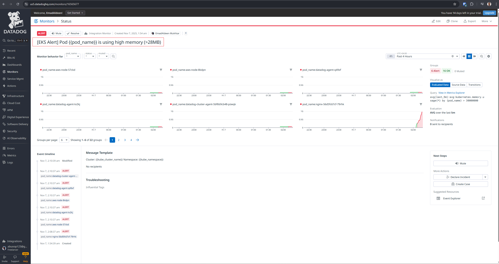
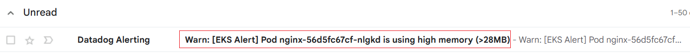

# K8: Kubernetes and Monitoring


Task Description:
1. EKS Cluster Setup:
   - Set up an Amazon EKS (Elastic Kubernetes Service) cluster.

2. Deploy a Sample Application:
   - Deploy a sample application to the EKS cluster.

3. Ingress Controller:
   - Set up an Ingress Controller to manage external access to the services running in the cluster.

4. Horizontal Pod Autoscaler (HPA):
   - Implement HPA based on memory utilization for the deployed application.

5. Monitoring:
   - Integrate Datadog for monitoring the Kubernetes cluster and the application.
   - Create dashboards and alerts in Datadog for critical metrics.

6. Documentation:
   - Document the steps to set up the EKS cluster, deploy the application, configure Ingress, and set up HPA.
   - Provide instructions for integrating Datadog and accessing monitoring dashboards.


---

## EKS Cluster Setup
- Requirements
    - Install AWS Cli
    - Install Kubectl
    - Install Eksctl
    - Create Ec2 instance as eks-admin or you can use your computer

- Install ``awscli`` for the credentials and interact with aws resources [reference](https://docs.aws.amazon.com/cli/latest/userguide/getting-started-install.html)
```bash
curl "https://awscli.amazonaws.com/awscli-exe-linux-x86_64.zip" -o "awscliv2.zip"
unzip awscliv2.zip
sudo ./aws/install
```

- Install ``Kubectl`` to interact with cluster [reference](https://kubernetes.io/docs/tasks/tools/install-kubectl-linux/#install-kubectl-binary-with-curl-on-linux)
```bash
curl -LO "https://dl.k8s.io/release/$(curl -L -s https://dl.k8s.io/release/stable.txt)/bin/linux/amd64/kubectl"
mkdir -p $HOME/bin && cp ./kubectl $HOME/bin/kubectl && export PATH=$HOME/bin:$PATH
echo 'export PATH=$HOME/bin:$PATH' >> ~/.bashrc
```

- Install ``eksctl`` to create the cluster [reference](https://docs.aws.amazon.com/eks/latest/eksctl/installation.html)
  - create eks cluster called ``demo-dct`` version  ``v1.33`` with two worker nodes called ``linux-nodes`` in  region ``us-east-1``
  and type of EC2 worker nodes is ``t3.medium``.

```bash
eksctl create cluster \
 --name demo-dct \
 --version 1.33 \
 --region us-east-1 \
 --nodegroup-name linux-nodes \
 --node-type t3.medium \
 --nodes 2
```

- Set the config for the current user [ec2-user]
```bash
aws eks --region us-east-1 update-kubeconfig --name demo-dct
```

## Deploy a Sample Application
It's simple application that display the pod name with name of the worker name that pod resident there,
and it's changed dynamically base on the selection of the LoadBalancer (ALB).

- Requirements
  - build the docker image Nginx and pushed to the ECR service, and this image has custom package stress
  which will used to test the HPA of the pods.
  - Shell script that grab the names of (pod & node).
    ```bash
    #!/bin/sh
    POD_NAME=$(hostname)
    POD_NAME=${POD_NAME:-"Unknown Pod"}
    NODE_NAME=${NODE_NAME:-"Unknown Node"}

    # Replace placeholders in HTML
    sed -i "s/{{POD_NAME}}/${POD_NAME}/g" /usr/share/nginx/html/index.html
    sed -i "s/{{NODE_NAME}}/${NODE_NAME}/g" /usr/share/nginx/html/index.html

    # Start Nginx
    nginx -g 'daemon off;'
    ```
  - Create an ECR repository called ``demo``
    ```bash
    # install docker, on the eks-admin machine
    sudo yum install -y docker

    # add current user to the docker group to build  and mange image
    sudo usermod -aG docker $USER

    # create ECR repo
    aws ecr get-login-password --region us-east-1 | docker login --username AWS --password-stdin account_id.dkr.ecr.us-east-1.amazonaws.com

    # build the image
    docker build -t nginx-stress:latest .

    # tag it
    docker tag demo:latest account_id.dkr.ecr.us-east-1.amazonaws.com/demo:latest

    # test the image before you push (optional)
    docker run -d -p 8080:80 nginx-stress:latest

    # list containers
    docker ps

    #set the container id
    docker exec -it container_id /bin/sh

    # execute this  line inside the container
    stress --cpu 8 --io 4 --vm  2 --vm-bytes  128M --timeout 10s

    # push it to ECR service
    docker push account_id.dkr.ecr.us-east-1.amazonaws.com/demo:latest
    ```
  - create a deployment (nginx-deployment)
    ```yml
    apiVersion: apps/v1
    kind: Deployment
    metadata:
    labels:
        app: nginx
    name: nginx
    spec:
    replicas: 3
    selector:
        matchLabels:
        app: nginx
    template:
        metadata:
        labels:
            app: nginx
        spec:
        containers:
        - image: acount_id.dkr.ecr.us-east-1.amazonaws.com/demo:latest
            imagePullPolicy: Always
            name: nginx
            resources:
            requests:
                memory: "256Mi"
                cpu: "200m"
            limits:
                memory: "512Mi"
                cpu: "500m"
            ports:
            - containerPort: 80
            env:
            - name: NODE_NAME
            valueFrom:
                fieldRef:
                fieldPath: spec.nodeName
    ```

    - Create a service which has LoadBalancer type to let external access to reach our services
    ```yml
    apiVersion: v1
    kind: Service
    metadata:
    name: nginx-lb
    spec:
    selector:
        app: nginx
    ports:
        - protocol: TCP
        port: 80
        targetPort: 80
    type: LoadBalancer

    ```

    - Deploy the application
    ```bash
    kubectl apply -f nginx-deployment.yaml
    kubectl apply -f nginx-service.yaml
    ```

## Ingress Controller
- Deploy ingress Controller
    ```yml
    apiVersion: networking.k8s.io/v1
    kind: Ingress
    metadata:
    name: nginx-ingress
    annotations:
        kubernetes.io/ingress.class: "nginx"
    spec:
    rules:
        - http:
            paths:
            - path: /
                pathType: Prefix
                backend:
                service:
                    name: nginx
                    port:
                    number: 80
    ```

## Horizontal Pod Autoscaler (HPA):
Implement HPA based on memory utilization for the deployed application
- Requirements:
  - metrics server
  - deployment horizontal pod autoscaler

  - HPA works on resource metrics
    ```bash
    # validation for the metrics server
    kubectl get deployment metrics-server -n kube-system
    kubectl top nodes
    kubectl top pods

    # create the yaml file
    kubectl autoscale deployment nginx \
    --cpu-percent=30 \
    --min=2 \
    --max=7 \
    --dry-run=client -o yaml > nginx-hpa.yaml
    ```
    - Then replace  in the nginx-hpa deployment
    ```yml
    - resource:
        name: cpu
        target:
        averageUtilization: 30
        type: Utilization
    ```
    with
    ```yml
    - resource:
        name: memory
        target:
        averageUtilization: 30
        type: Utilization
    ```

    ### Now we  need to stress the pod
    - Practice memory stress
    ```bash
    kubectl get pods

    # login inside any pod of the nginx-deployment and execute stress
    kubect exec -it nginx-pod_id -- sh

    # then start stress
    stress --cpu 8 --io 4 --vm 2 --vm-bytes 128M --timeout 60s

    # fast stress
    stress --vm 1 --vm-bytes 1000M --vm-hang 0
    ```

## Monitoring:
- Requirements:
  - Create an account on datadog
  - Install Helm page manager
  - Deploy datadog deployment on the cluster


- Install Helm package on Linux
```bash
curl -fsSL -o get_helm.sh https://raw.githubusercontent.com/helm/helm/main/scripts/get-helm-3
chmod 700 get_helm.sh
./get_helm.sh
```

- Integrate  Helm package manager
```bash
helm repo add datadog https://helm.datadoghq.com
helm install datadog-operator datadog/datadog-operator
kubectl create secret generic datadog-secret --from-literal api-key=``
```

- Update the Agent configuration file
```yml
kind: "DatadogAgent"
apiVersion: "datadoghq.com/v2alpha1"
metadata:
  name: "datadog"
spec:
  global:
    site: "us5.datadoghq.com"
    credentials:
      apiSecret:
        secretName: "datadog-secret"
        keyName: "api-key"
    registry: "public.ecr.aws/datadog"
    tags:
      - "env:dev"
      - "demo-dct"
  features:
    logCollection:
      enabled: true
      containerCollectAll: true
    otelCollector:
      enabled: true
      ports:
        - containerPort: 4317
          hostPort: 4317
          name: "otel-grpc"
        - containerPort: 4318
          hostPort: 4318
          name: "otel-http"
```
- Then deploy the Agent
`` kubectl apply -f datadog-agent.yaml ``


## Screenshots Stress test memory
- Tracking HPA using watch
``kubectl get hpa -w ``

- When the memory limit equal 50%
```yml
apiVersion: autoscaling/v2
kind: HorizontalPodAutoscaler
metadata:
  name: nginx-hpa
spec:
  scaleTargetRef:
    apiVersion: apps/v1
    kind: Deployment
    name: nginx
  minReplicas: 2
  maxReplicas: 7
  metrics:
  - type: Resource
    resource:
      name: memory
      target:
        type: Utilization
        averageUtilization: 50
```
- Container limits
```yml
containers:
- image: account_id.dkr.ecr.us-east-1.amazonaws.com/demo:latest
imagePullPolicy: Always
name: nginx
resources:
    requests:
    memory: "256Mi"
    cpu: "200m"
    limits:
    memory: "512Mi"
    cpu: "500m"
```
<p>
  <a href="assets/image_screen_shot_for_memory_stress1.png"></a>
</p>

- When the memory limit equal 20%
```yml
apiVersion: autoscaling/v2
kind: HorizontalPodAutoscaler
metadata:
  name: nginx-hpa
spec:
  scaleTargetRef:
    apiVersion: apps/v1
    kind: Deployment
    name: nginx
  minReplicas: 2
  maxReplicas: 7
  metrics:
  - type: Resource
    resource:
      name: memory
      target:
        type: Utilization
        averageUtilization: 20
```
<p>
  <a href="assets/image_screen_shot_for_memory_stress2.png"></a>
</p>


## Website


## Datadog Dashboard

<p>
  <a href="assets/1.png"></a>
  <a href="assets/2.png"></a>
  <a href="assets/3.png"></a>
  <a href="assets/9.png"></a>
</p>

<p>
  <a href="assets/4.png"></a>
  <a href="assets/5.png"></a>
  <a href="assets/6.png"></a>
  <a href="assets/7.png"></a>
</p>


## Clean up
```bash
eksctl delete cluster --name demo-dct
```